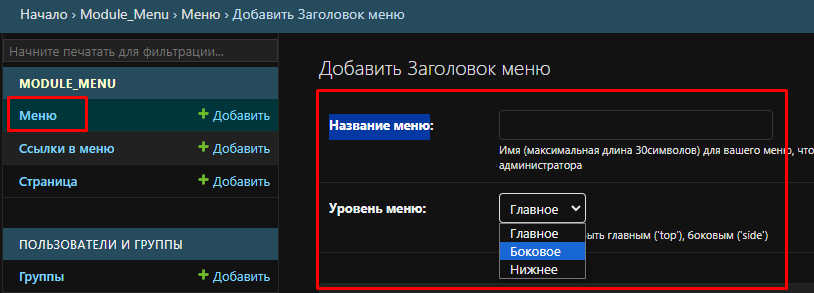

## .ENV
File `.env` make in project's root  
```text
DJANGO_SECRET_KEY=secret_key_of_your_django
DJANGO_SETTING_POSTGRES_DB=db_name_of_your_db
DJANGO_SETTING_POSTGRES_USER=user_name_of_your_db
DJANGO_SETTING_POSTGRES_PASSWORD=password_of_your_db
DJANGO_SETTING_POSTGRES_HOST=host_of_your_db
DJANGO_SETTING_POSTGRES_PORT=port_of_your_db
```

## project_root.settings
```python
# project_root.settings.py
# ...
LANGUAGE_CODE = "ru"
# ...
TIME_ZONE = "Asia/Novosibirsk"
# ...
DEFAULT_CHARSET = "utf-8"
```

## Descript
Модуль не стал привязывать к пользователю.\
### Раздел "Меню"
Для создания рабчего вида, в панели администратора заходим: 
- `"Название меню"` Название меню любое.
- `"Уровень меню"`. Выбранный вами уровень меню регулирует размещение меню.
    - `"Главное"` Верхнее меню.
    - `"Боковое"` Меню с боку или в центре страницы.
    - `"Нижнее"` Меню в низу страницы.

 \
Note!: *Полностью логика не реализована (в данном задании). Если создаем \
более одного меню на одном уровне, нет возможности разделить для размещения \
на странице*.

### Раздел "Страница"
- **Маршрут** `"тут/путь/страницы/"`. После этот путь будете выбирать в \
разделе `"Ссылки в меню"`.
- **Текст ссылки** Текст который увидим в качестве заголовка страницы.
- **Активное** Значение `True` - страница публикуется или на оборот.
- **Выбрать шаблон для страницы** Выбираем шаблона для страницы. Шаблон \
выбранный вами создаёт стилевое оформление контента на странице. То как \
визуально будет представлен контент на странице.
- **Выбрать меню** Выбрать меню (одно или несколько) которые будет \
публиковаться на странице. \


#### Главная страница! 
Маршрутом главной страницы должен являться текст `index/`. На данный текст \
ориентируется логика.

### Раздел "Ссылки в меню"
Вначале создаем ссылку нулевого уровня вложенности.\
- **Выбрать страницу** тут выбирая страницу, на самом деле выбирается \
маршрут который после будет публиковаться в `<a href="тут/"`.
- **Текст ссылки** после будет публиковаться в `<a>тут</a>`
- **Активное** значение `True` - ссылка публикуется в меню, или на оборот.\


#### "МЕНЮ И ПОД-МЕНЮ"
Создаем дочерние ссылки.
- **ТЕКСТ ССЫЛКИ** не обязательное поле (может оставаться пустым). \
Аналог **Текст ссылки**. 
- **МАРШРУТ** не обязательное поле (может оставаться пустым). Прописываем \
маршрут ссылки по шаблону `<a href="тут/путь/дочерней/ссылки/".`\


#### Важно
- **ВЫБРАТЬ МЕНЮ** обязательное поле в котором выбираем одно или несколько из \
раннее созданных меню (создаёте новое) в разделе `"Меню"`"`. Если родительская \
ссылка активна - публикуем в меню в не зависимости есть или нету \
дочерних ссылок.\


### Task
> Все, что над выделенным пунктом - развернуто.

Значит первый уровень вложенности раскрывать НАД основным меню.

Но, читаем дальше 
> Первый уровень вложенности под выделенным пунктом тоже развернут.

Или первый уровень вложенности раскрывать ПОД основным меню? \
Но есть прилагательное `тоже`.
> Все, что над выделенным пунктом - развернуто. Первый уровень вложенности \
> под выделенным пунктом тоже развернут.

Так:
- в верх раскрывать?
- или в низ раскрывать?
- или при каких условиях открывать в верх, а при каких в низ?

#### Далее
> На отрисовку каждого меню требуется ровно 1 запрос к БД

Так же абстрактная формулировка. Как данное событие должно выглядеть со \
стороны пользователя - не понятно.

*P.S.: Вопросы к многообразной формулировке задач не отражает опыт разработчика.* 
