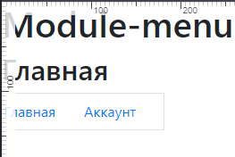

## Примечание
Задание заняло:
- фактически 3 рабочих дня включая настройку среды
- календарных 4 дня. Просто бывают рабочие дни которые проходят вопреки наших планов.

Данный файл, если того требует компания, возможно написать на  английском. \

### Ещё деталь
1.
Главный/базовый шаблон проекта `module_menu/templates/layout/index.html`.\
Главный и остальные шаблоны запускаются лишь от из 1-ой \
функции `get_index_page` по маршруту `module_menu/views.py`.\
Эти самые "остальные шаблоны" подставляются динамически.

2.
Главный шаблон имеет 2-реализации меню. \
Согласно заданию представлено в html `<float>`. \
Абстрактное меню  представлено в html `<main>`. Его цель, показать понимание \
работы с шаблонными тегами django и прочую логику с ними. 

3.
Задача представленная вами имеет абстрактные формулировки. Но согласно \
вашим же условиям - проводить уточнение того, что тем или иным хотели описать - запрещено.\
Сделано как понял. \
Работаем только с Django. JS под вопросом. Всё остальное в конце файла.

4.
Проект имеет предварительный/сырой макет базы данных `archive/`.

## .ENV
Файл `.env` разместите в корне проекта 
```text
DJANGO_SECRET_KEY=secret_key_of_your_django
DJANGO_SETTING_POSTGRES_DB=db_name_of_your_db
DJANGO_SETTING_POSTGRES_USER=user_name_of_your_db
DJANGO_SETTING_POSTGRES_PASSWORD=password_of_your_db
DJANGO_SETTING_POSTGRES_HOST=host_of_your_db
DJANGO_SETTING_POSTGRES_PORT=port_of_your_db
```

## project_root.settings
```python
# project_root.settings.py
# ...
LANGUAGE_CODE = "ru"
# ...
TIME_ZONE = "Asia/Novosibirsk"
# ...
DEFAULT_CHARSET = "utf-8"
```
## Commands
Базовые команды от Django.

## Dependence
Удалите файл `pyproject.toml` если в качестве установщика используете `pip`. \
Проект собирался на установщике `Poetry`\
[requirements.txt](requirements.txt) продукт авто-сборки от `Poetry`.

## Descript
Модуль не стал привязывать к пользователю.\
Администратор имеет возможность:
 - создавать не ограниченное количество меню.
 - каждое отдельно взятое меню имеет свой набор и вложенность ссылок. В данной \
версии, дочерние ссылку углубляются только на 1-н уровень.

### Раздел "Меню"
Создаём название меню и выбираем уровень: 
- `"Название меню"` Название меню любое. 
- `"Уровень меню"` Уровень регулирует лишь набор ссылок. Это некая \
категория/уровень меню которая позволит в одном (неком) блоке размещать \
более одного меню.
    - `"Главное"` Верхнее меню.
    - `"Боковое"` Меню с боку или в центре страницы.
    - `"Нижнее"` Меню внизу страницы.

 \
Note!: *Полностью логика не реализована (в данном задании). Если создаем \
более одного меню на одном уровне, нет возможности разделить для размещения \
на странице*.

#### Для примера с уровнями.

```html
  <footer>

    <div class="row">
      
    </div>
  </footer>
```
 \
или \
```html
  <footer>

    <div class="row">
      
    </div>
  </footer>
```


### Раздел "Страница"
- **Маршрут** `"тут/путь/страницы/"`. После этот путь будем выбирать, в \
разделе `"Ссылки в меню"`, по названию/заголовку самой страницы. \
- **Текст ссылки** Текст который увидим в качестве заголовка страницы.
- **Активное** Значение `True` - ссылка публикуется или на оборот.
- **Выбрать шаблон для страницы** Выбираем шаблона для страницы. Шаблон \
выбранный вами создаёт стилевое оформление контента на странице. То как \
визуально будет представлен контент на странице.
- **Выбрать меню** Выбрать меню (одно или несколько) которые будет \
публиковаться на странице. \


#### Главная страница! 
Маршрутом главной страницы должен являться текст `index/`. На данный текст \
ориентируется логика.

### Раздел "Ссылки в меню"
Вначале создаем ссылку нулевого уровня вложенности.\
- **Выбрать страницу** тут выбирая страницу, на самом деле выбирается \
маршрут который после будет публиковаться в `<a href="тут/"`.
- **Текст ссылки** после будет публиковаться в `<a>тут</a>`
- **Активное** значение `True` - ссылка публикуется в меню, или на оборот.\


#### "МЕНЮ И ПОД-МЕНЮ"
Создаем дочерние ссылки.
- **ТЕКСТ ССЫЛКИ** не обязательное поле (может оставаться пустым). \
Аналог **Текст ссылки**. 
- **МАРШРУТ** не обязательное поле (может оставаться пустым). Прописываем \
маршрут ссылки по шаблону `<a href="тут/путь/дочерней/ссылки/".`\


#### Важно
- **ВЫБРАТЬ МЕНЮ** обязательное поле в котором выбираем из \
раннее созданных меню (или создаёте новое) в разделе `"Меню"`"`. Если родительская \
ссылка активна - публикуем в меню в не зависимости наличия \
дочерних ссылок.\
- Дочерние ссылки возможно дублировать, чтоб указать дополнительное меню \
в котором она будет опубликована. \


### Task
> Все, что над выделенным пунктом - развернуто.

Значит первый уровень вложенности раскрывать НАД основным меню.

Но, читаем дальше 
> Первый уровень вложенности под выделенным пунктом тоже развернут.

Или первый уровень вложенности раскрывать ПОД основным меню? \
Но есть прилагательное `тоже`.
> Все, что над выделенным пунктом - развернуто. Первый уровень вложенности \
> под выделенным пунктом тоже развернут.

Так:
- в верх раскрывать?
- или в низ раскрывать?
- или при каких условиях открывать в верх, а при каких в низ?

#### Далее
> На отрисовку каждого меню требуется ровно 1 запрос к БД

Так же абстрактная формулировка. Как данное событие должно выглядеть со \
стороны пользователя - не понятно.

*P.S.: Вопросы к многообразной формулировке задач не отражает опыт разработчика.* 
